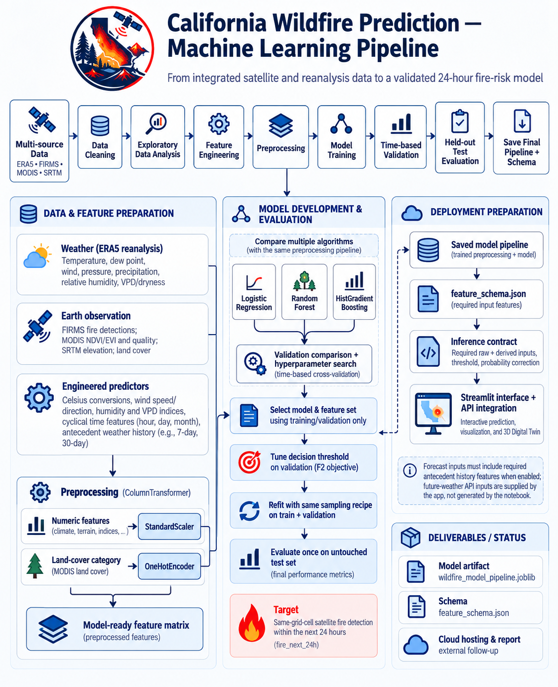
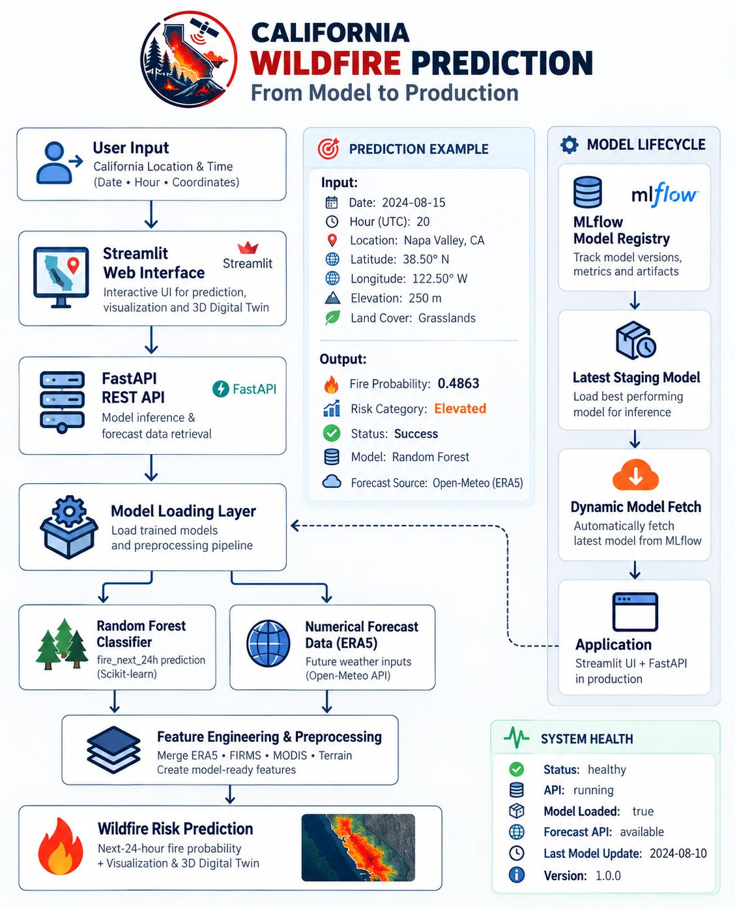

# California Wildfire Prediction & 3D Digital Twin

[](https://www.python.org/)
[](https://streamlit.io/)
[](https://scikit-learn.org/)
[](https://opensource.org/licenses/MIT)
[](https://github.com/AhmedShaban0/CaliforniaWildfire-Prediction-DigitalTwin)

An enterprise-grade geospatial machine learning intelligence platform and interactive 3D Digital Twin for forecasting next-24-hour wildfire detection risk across California. The system fuses Copernicus ERA5 atmospheric thermodynamics, NASA FIRMS thermal anomaly satellite telemetry, MODIS vegetative stress indices, and SRTM digital topography on a standardized 0.25° grid (~25 km × 25 km).

---

## 🚀 Live Demo

- **Production URL:** [https://california-wildfire.streamlit.app/](https://california-wildfire.streamlit.app/) *(or local: `http://localhost:8501`)*
- **GitHub Repository:** [https://github.com/AhmedShaban0/CaliforniaWildfire-Prediction-DigitalTwin](https://github.com/AhmedShaban0/CaliforniaWildfire-Prediction-DigitalTwin)

---

## 📌 Architecture & ML Workflow



The application models the empirical probability of a spaceborne wildfire detection in any California 0.25° grid cell over the subsequent 24 hours ($t+1$ to $t+24$) strictly using observations available at hour $t$, enforcing a zero-leakage 24-hour causal embargo buffer.



---

## 🌟 Key Capabilities

### 1. Two Intuitive Wildfire Prediction Workflows
- **Mode 1 — Manual Environmental Input:**
  - Interactive parameter controls for 2m air temperature, dewpoint temperature, surface atmospheric pressure, vector wind velocity, 10m wind direction, precipitation, vegetation stress (NDVI/EVI), and geographic coordinates.
  - Real-time client-side physical validation (e.g. vapor pressure deficit clipping, relative humidity saturation constraints, dewpoint vs. temperature validation).
  - Instant dispatch to the scikit-learn pipeline returning raw model probabilities, calibrated natural probabilities, operational alert state, and standardized risk tier (Low, Moderate, High, Extreme).
- **Mode 2 — Select Date & Predict (Automated API Retrieval):**
  - Select any historical observation date or forward forecast window (up to 7 days ahead) for any verified California coordinate or preset regional hotspot.
  - Automatically queries the **Open-Meteo Global Weather Model** API for hourly atmospheric thermodynamics and 30-day antecedent accumulation history (rain accumulation over 24h, 7d, 30d; rolling mean VPD and temperature).
  - Automatically retrieves spaceborne vegetation indices and SRTM elevation from the calibrated spatial grid cache and executes model inference in under 500 ms.

### 2. California 3D Digital Twin
- **WebGL Hardware-Accelerated 3D Topographic Mesh:**
  - Topographic elevation extrusion rendered dynamically via **PyDeck (deck.gl)** and **Plotly 3D Orbital Scatter**.
  - Interactive camera controls: adjustable pitch ($0^\circ$ to $60^\circ$), bearing ($-180^\circ$ to $180^\circ$), and elevation scaling ($1.0\times$ to $6.0\times$).
  - Multi-layer visual switching: Model Predicted Risk, SRTM Elevation, Temperature, Vapor Pressure Deficit (VPD), Wind Magnitude, and NASA FIRMS active detections.
  - Fully functional in cloud deployment via pre-calibrated snapshot caching (~480 KB).

### 3. Executive Dashboard & Comprehensive Benchmarks
- **Model Performance Page:** Deep-dive into test-split evaluation, PR-AUC and ROC-AUC curves, confusion matrices, $F_\beta$ threshold tuning curves, and permutation feature importance.
- **Data & Methodology Page:** Transparent scientific documentation of multi-sensor data ingestion, causal time-series splits, imbalance handling, and prior-shift odds calibration.
- **Dark Theme Executive Design:** Purpose-built aesthetic with deep navy background (`#081827`), card surfaces (`#102A43`), fire-accent palette, compact zero-scroll sidebar navigation, and official project branding.

---

## 📊 Model Contract & Validated Evaluation Benchmarks

### Training & Architecture Specifications
- **Model Type:** Scikit-Learn `Pipeline` bundling preprocessing and classification.
  - `preprocessor`: `ColumnTransformer` with `StandardScaler` on 32 numeric features and `OneHotEncoder(handle_unknown='ignore', dtype=float32)` on `land_cover`.
  - `model`: `RandomForestClassifier(n_estimators=200, max_features=0.5, max_samples=0.3, min_samples_leaf=5, n_jobs=-1, random_state=42)`.
- **Selected Feature Set:** `+ location` (33 features total: 32 numeric, 1 categorical).
- **Split Methodology:** Strict chronological train / validation / test splits with a 24-hour causal embargo buffer at each boundary to eliminate spatio-temporal leakage.
- **Decision Threshold ($\tau$):** **`0.2507`** (optimized for $F_2$-score on the validation split, placing twice the weight on recall vs. precision).
- **Probability Correction:** Prior-shift odds formula adjusting for balanced training subsampling back to natural California fire prevalence ($\pi_{\text{nat}} = 6.04\%$, $\pi_{\text{eff}} = 27.16\%$).

### Held-Out Test Split Performance (400,000 Rows)
*All metrics below were computed on strictly held-out chronological test observations and verified in `California_Wildfire_ML_final_5_improved.ipynb`:*

| Evaluation Metric | Tuned Model ($\tau=0.2507$) | Default Baseline ($\tau=0.5000$) |
|---|---|---|
| **PR-AUC (Average Precision)** | **0.4863** | 0.4863 *(Invariant to threshold)* |
| **ROC-AUC** | **0.8844** | 0.8844 *(Invariant to threshold)* |
| **Recall (Fires Caught)** | **70.78%** | 51.63% |
| **Precision** | **29.08%** | 49.56% |
| **$F_1$-Score** | **0.4123** | 0.5058 |
| **$F_2$-Score ($\beta=2.0$)** | **0.5501** | 0.5121 |
| **Accuracy** | **88.20%** | 94.10% |
| **Operational Alert Rate** | **14.23%** | 6.09% |
| **No-Skill PR-AUC Baseline** | **0.0585** | 0.0585 |

*Validation Split (Tuning Partition):* Validation PR-AUC = `0.4427`, Validation $F_2$ = `0.4844` at $\tau=0.2507$.

---

## 🗂️ Repository Structure

```text
California_Wildfire_Prediction/
├── .streamlit/
│   └── config.toml               # Custom deep navy theme tokens & server settings
├── assets/
│   ├── wildfire.png              # Primary project branding logo
│   ├── wildfire.jpg              # Original visual asset
│   ├── curated_snapshots.parquet # Standalone 3D Digital Twin snapshot cache (~480 KB)
│   └── california_grid_static.parquet # Grid elevation & land cover cache (~23 KB)
├── pages_impl/
│   ├── overview.py               # Executive landing dashboard & statewide spatial view
│   ├── prediction.py             # Dual-mode prediction workspace (Manual & Forecast API)
│   ├── digital_twin.py           # Interactive 3D deck.gl & Plotly WebGL twin
│   ├── performance.py            # Verified held-out test benchmarks & curves
│   ├── methodology.py            # Data pipeline, physics, & calibration deep-dive
│   └── about.py                  # Project background, ethical boundaries, & references
├── src/
│   ├── data_loader.py            # NetCDF lazy reading, Open-Meteo API, & caches
│   ├── model_loader.py           # Pipeline loading, schema validation, prior-shift odds
│   ├── theme.py                  # UI CSS tokens, compact sidebar, & HTML helpers
│   └── twin_3d.py                # deck.gl PyDeck & Plotly 3D visualizers
├── California_Wildfire_ML_final_5_improved.ipynb # Canonical 99-cell ML training notebook
├── MODEL_UPDATE_AUDIT.md         # Full audit report of model contract & test results
├── DEPLOYMENT.md                 # Deployment instructions for cloud platforms
├── Dockerfile                    # Container definition for containerized deployments
├── requirements.txt              # Pinned runtime dependencies
├── feature_schema.json           # Machine-readable model schema & winsorization bounds
├── wildfire_model_pipeline.joblib# Serialized fitted Scikit-Learn Pipeline (~91 MB)
├── LICENSE                       # MIT License
└── app.py                        # Streamlit application entry-point
```

---

## 💻 Local Installation & Quickstart

### Prerequisites
- Python 3.11, 3.12, or 3.14
- Git

### 1. Clone the Repository
```bash
git clone https://github.com/AhmedShaban0/CaliforniaWildfire-Prediction-DigitalTwin.git
cd CaliforniaWildfire-Prediction-DigitalTwin
```

### 2. Create and Activate Virtual Environment
```bash
# Windows PowerShell:
python -m venv .venv
.\.venv\Scripts\Activate.ps1

# Linux / macOS:
python3 -m venv .venv
source .venv/bin/activate
```

### 3. Install Runtime Dependencies
```bash
pip install --upgrade pip
pip install -r requirements.txt
```

### 4. Run the Streamlit Application
```bash
streamlit run app.py
```
Open your browser to `http://localhost:8501`.

---

## ☁️ Deployment Instructions

### Streamlit Community Cloud (Recommended)
1. Fork or push this repository to your GitHub account: `https://github.com/AhmedShaban0/CaliforniaWildfire-Prediction-DigitalTwin`.
2. Visit [share.streamlit.io](https://share.streamlit.io) and log in with your GitHub account.
3. Click **"New app"**.
4. Select repository: `AhmedShaban0/CaliforniaWildfire-Prediction-DigitalTwin`.
5. Select branch: `main`.
6. Set Main file path: `app.py`.
7. Click **"Deploy!"**.
*(The repository is pre-configured with `assets/curated_snapshots.parquet` and `assets/california_grid_static.parquet`, ensuring instant startup without requiring multi-gigabyte raw dataset transfers).*

### Docker Deployment
```bash
docker build -t california-wildfire-twin .
docker run -p 8501:8501 california-wildfire-twin
```

---

## ⚠️ Scientific Limitations & Responsible-Use Notice

- **Empirical Probability vs. Flame Simulation:** This system models the statistical probability of satellite thermal detection based on atmospheric thermodynamics, fuel moisture deficit, and geographic features. It **does not simulate active flame fronts, cellular automata fire spread, flame lengths, or CFD ember transport**.
- **Not an Emergency Dispatch System:** Predictions are provided for research, planning, and situational intelligence. They do not constitute official evacuation alerts or operational firefighting directives. Always consult CAL FIRE, NWS, and local emergency authorities during active fire events.

---

## 📜 Credits & References
- **ERA5 Atmospheric Reanalysis:** Copernicus Climate Change Service (ECMWF).
- **Active Fire Detections:** NASA FIRMS (MODIS & VIIRS active fire data).
- **Vegetation Indices & Land Cover:** NASA Earthdata / USGS MODIS MCD12Q1, MOD13A2.
- **Topography:** NASA Shuttle Radar Topography Mission (SRTM 90m DEM).
- **Weather Forecast API:** Open-Meteo Global Meteorological Model (ECMWF IFS / GFS).
- **Author:** Ahmed Shaban ([GitHub](https://github.com/AhmedShaban0))
- **License:** [MIT License](LICENSE)
